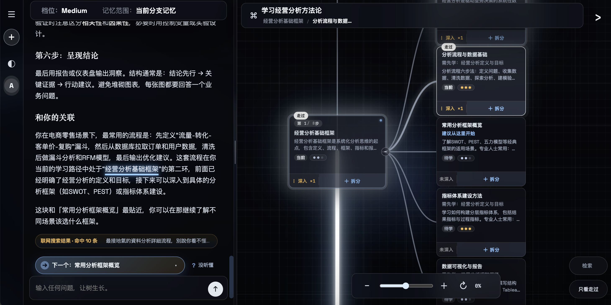
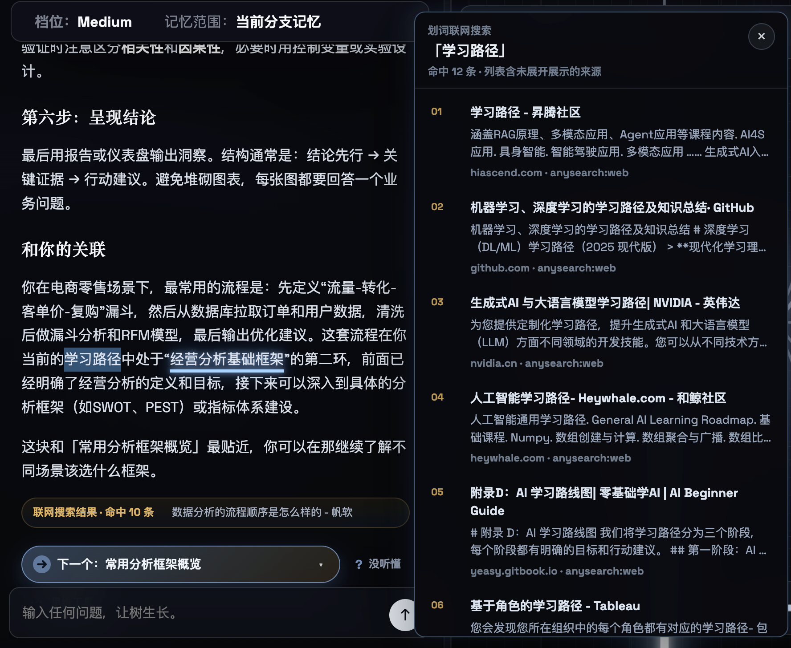
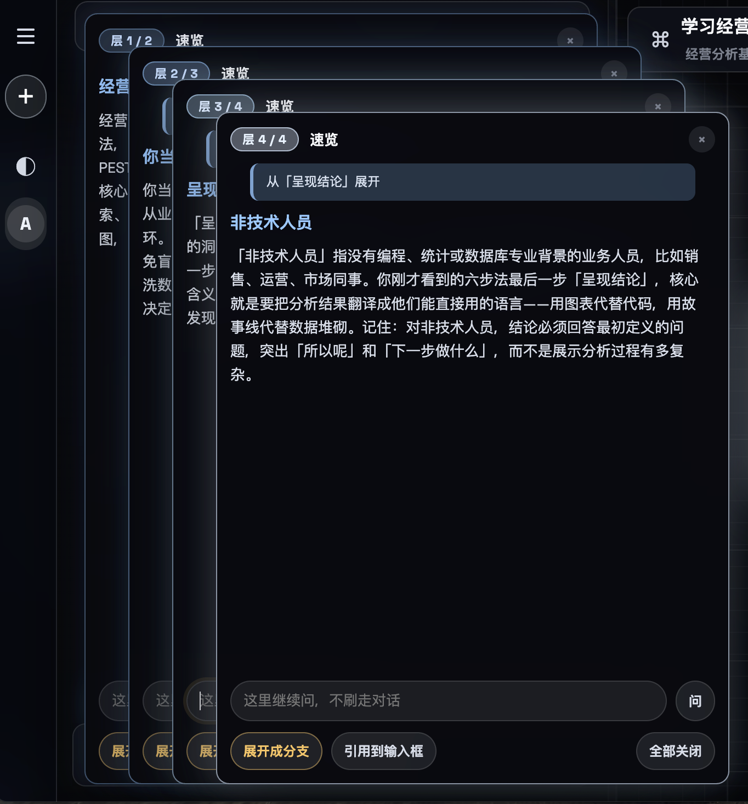
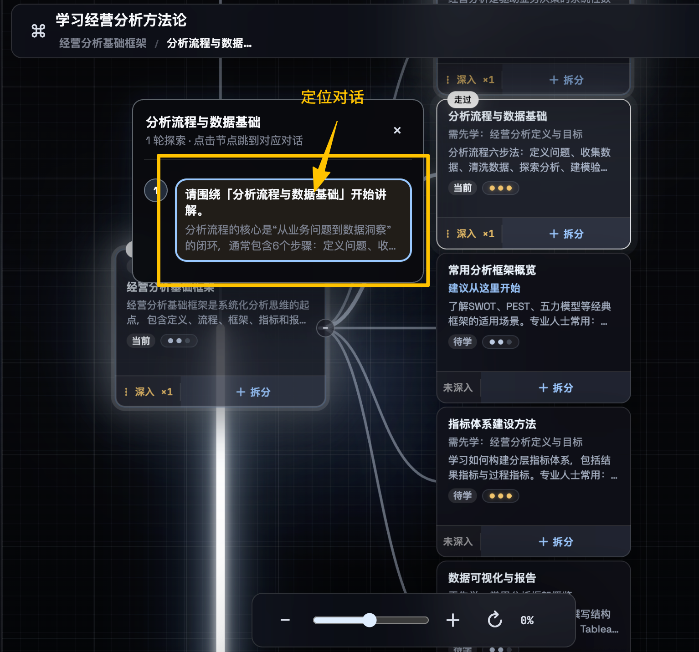

<div align="center">


# TJ Sylva

**A knowledge forest — chat with AI on the left, watch a structured knowledge tree grow on the right**

[简体中文](README.md) | English

[](LICENSE)
[](https://www.python.org/)
[](https://github.com/nitianji415/TJ-Sylva/actions/workflows/ci.yml)
[](https://www.bilibili.com/video/BV1GcGX6iEUG/)

📺 **[Watch the demo video (Bilibili)](https://www.bilibili.com/video/BV1GcGX6iEUG/)**

</div>

> Come in with a concrete question. The AI first sketches a map, then coaches you step by step — go deeper, skip, review — and distills everything into a structured knowledge tree.

Backend: FastAPI + SQLAlchemy + Alembic + Postgres. Frontend: vanilla HTML/CSS/JS. The LLM speaks a single OpenAI-compatible protocol (DeepSeek / Moonshot / OpenRouter / self-hosted vLLM … just change `base_url`).

> **⚠️ Security:** Before any production deployment, change `SETTINGS_SECRET` / `JWT_SECRET` / `ADMIN_PASSWORD`, and **never commit a real database or `.env`**. See [Security](#security).

## ✨ Features

<table>
<tr>
<td width="50%" valign="top">

**🗺️ Chat that becomes a map**

Talk to an AI coach on the left; a structured knowledge tree grows on the right as you learn.



</td>
<td width="50%" valign="top">

**🌐 Select-to-search the web**

Select any phrase to trigger a live web search, returning result cards with sources.



</td>
</tr>
<tr>
<td width="50%" valign="top">

**🔎 Select-to-peek explain**

Select text for an instant inline explanation — ask about anything without breaking your flow.



</td>
<td width="50%" valign="top">

**🎯 Node-anchored chat**

Click any node on the tree to anchor the conversation there and keep explaining around it.



</td>
</tr>
</table>

## Quick start (Docker, recommended)

```bash
git clone https://github.com/nitianji415/TJ-Sylva.git
cd TJ-Sylva
cp .env.example .env
# Edit .env:
#   - set LLM_API_KEY (defaults to DeepSeek)
#   - for production, change ADMIN_PASSWORD / JWT_SECRET / SETTINGS_SECRET
docker compose up -d
```

Open [http://127.0.0.1:8765](http://127.0.0.1:8765) and log in with `admin / admin` (or the password you set). You'll be prompted to change the default password on first login.

Three services: **app** (FastAPI + static frontend on `8765`), **postgres** (16-alpine), **open-websearch** (free local web-search daemon, built from upstream `Aas-ee/open-webSearch`).

```bash
docker compose logs -f app     # backend logs
docker compose down            # stop, keep data
docker compose down -v         # stop and wipe DB (careful)
```

## Development (without Docker)

```bash
python3 -m venv .venv && source .venv/bin/activate
pip install -e ".[dev]"

docker compose up -d postgres   # or switch DATABASE_URL to SQLite in .env
cp .env.example .env            # fill in your API key
alembic upgrade head
python3 app.py                  # or: uvicorn app.main:app --reload
```

Default: `http://127.0.0.1:8765`.

## Tests

```bash
pytest                    # in-memory SQLite, external LLM disabled
./scripts/smoke_test.sh   # spins up uvicorn and hits the core API end-to-end
```

## LLM configuration

A single OpenAI Chat Completions–compatible protocol; falls back to a local rule engine on failure.

```bash
LLM_API_KEY=sk-...                        # default DeepSeek (platform.deepseek.com)
LLM_MODEL=deepseek-chat                    # or deepseek-reasoner, moonshot-v1-8k, ...
LLM_BASE_URL=https://api.deepseek.com/v1   # point to any OpenAI-compatible service
```

`SEARCH_PROVIDER`: `open` (default, free local daemon) · `anysearch` (aggregated API, set `ANYSEARCH_API_KEY`) · `off`.

## Security

Sensitive config (LLM API keys, etc.) is **stored encrypted in the database**, with the master key derived from `SETTINGS_SECRET`. Before deploying:

- **Change the three defaults** via environment variables, otherwise encryption is meaningless:
  - `SETTINGS_SECRET` — master key for encrypting API keys; the default value lets anyone with the DB decrypt them.
  - `JWT_SECRET` — login token signing.
  - `ADMIN_PASSWORD` — defaults to `admin/admin`.
  - The backend prints a loud warning at startup if any default is still in use.
- Generate a strong secret: `python3 -c "import secrets; print(secrets.token_urlsafe(48))"`
- **Never commit a real database** (`data/*.sqlite3`) or `.env` — both are gitignored.
- Report vulnerabilities privately, see [SECURITY.md](SECURITY.md).

## Contributing

Issues and PRs welcome — see [CONTRIBUTING.md](CONTRIBUTING.md). By participating you agree to the [Code of Conduct](CODE_OF_CONDUCT.md).

## License

[MIT](LICENSE) © 2026 nitianji415

> Web search relies on upstream [`Aas-ee/open-webSearch`](https://github.com/Aas-ee/open-webSearch) (fetched at Docker build time, not distributed with this repo); please follow its respective license.
